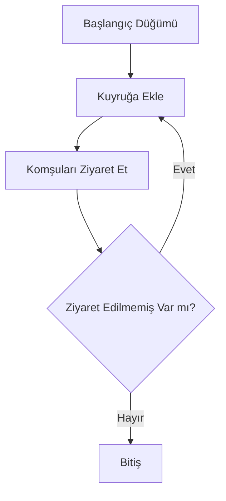
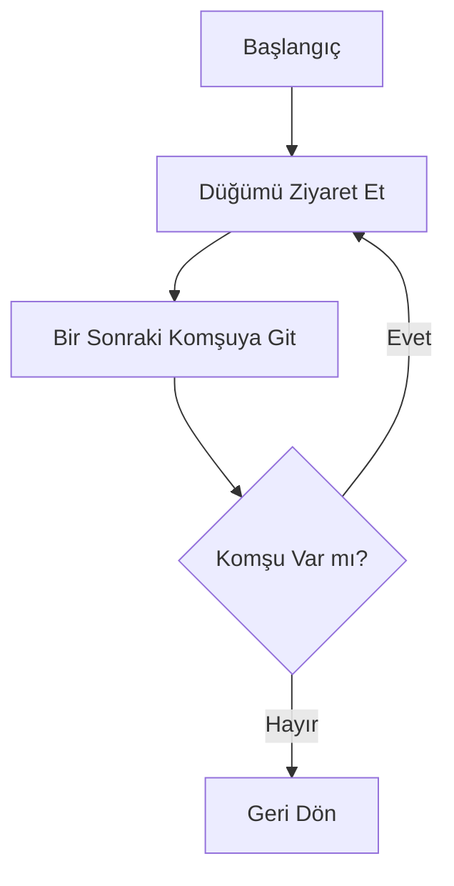
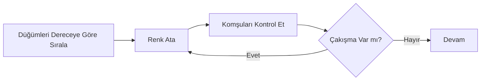
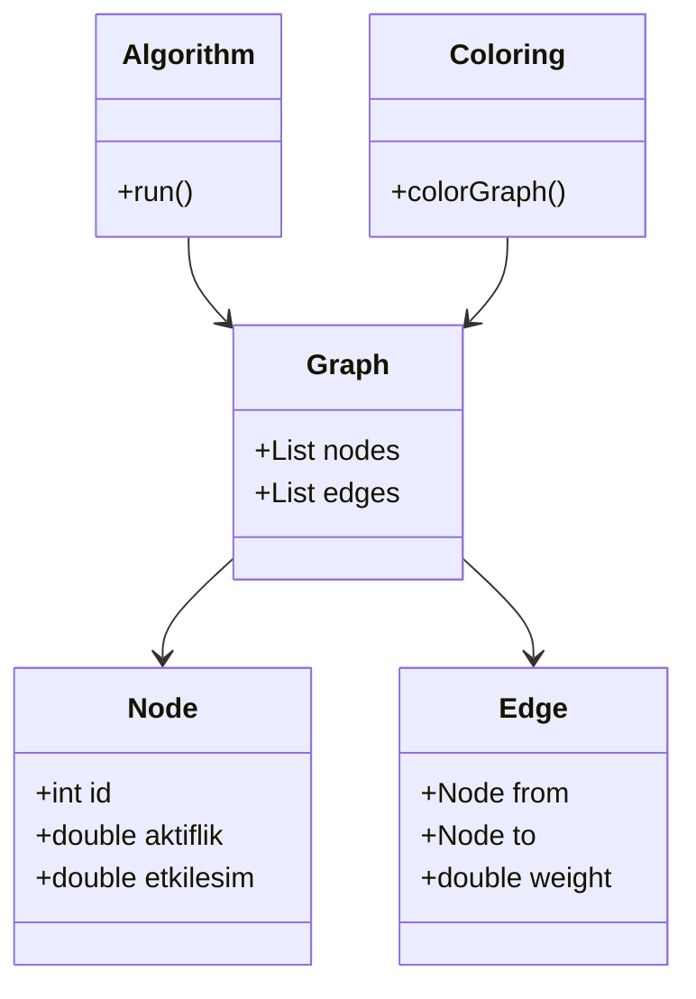

<!-- PROJECT SHIELDS -->
[![Contributors][contributors-shield]][contributors-url]
[![Forks][forks-shield]][forks-url]
[![Stars][stars-shield]][stars-url]

<!-- BADGE LINKS -->
[contributors-shield]: https://img.shields.io/github/contributors/AboubacarSow/yazlab-proje-II?style=for-the-badge
[contributors-url]: https://github.com/AboubacarSow/yazlab-proje-II/graphs/contributors

[forks-shield]: https://img.shields.io/github/forks/AboubacarSow/yazlab-proje-II?style=for-the-badge
[forks-url]: https://github.com/AboubacarSow/yazlab-proje-II/network/members

[stars-shield]: https://img.shields.io/github/stars/AboubacarSow/yazlab-proje-II?style=for-the-badge
[stars-url]: https://github.com/AboubacarSow/yazlab-proje-II/stargazers


# Sosyal Ağ Analizi Uygulaması

**Ders:** Yazılım Geliştirme Laboratuvarı-I  
**Bölüm:** Bilişim Sistemleri Mühendisliği – Teknoloji Fakültesi  
**Üniversite:** Kocaeli Üniversitesi  
**Proje:** Proje – 2  
**Tarih:** 02.01.2026

**Ekip Üyeleri:**

* Öğrenci 1 (No)
* Öğrenci 2 (No)

---

## 1. Giriş

Sosyal ağlar, bireyler veya varlıklar arasındaki ilişkilerin modellenmesi ve analiz edilmesi açısından önemli veri kaynaklarıdır. Bu projede, kullanıcılar arasındaki ilişkileri bir **graf veri yapısı** ile temsil eden ve çeşitli **graf algoritmaları** yardımıyla bu yapıyı analiz eden etkileşimli bir **Sosyal Ağ Analizi Uygulaması** geliştirilmiştir.

Projenin temel amacı; graf teorisi, algoritma analizi, nesne yönelimli programlama (OOP), veri saklama ve görselleştirme konularının bütünleşik olarak uygulanmasıdır.

---

## 2. Problemin Tanımı ve Amaç

Problem, kullanıcılar ve aralarındaki etkileşimlerden oluşan bir sosyal ağın dinamik olarak yönetilmesi ve analiz edilmesidir. Kullanıcıların:

* Ağ üzerindeki konumları,
* Birbirleriyle olan mesafeleri,
* Topluluk yapıları,
* En etkili düğümleri

graf algoritmaları yardımıyla belirlenmektedir.

Amaç, bu analizleri hem **görsel** hem de **sayısal** olarak sunabilen, kullanıcı etkileşimine açık bir yazılım geliştirmektir.

---

## 3. Kullanılan Algoritmalar

### 3.1 BFS (Breadth First Search)

Bir başlangıç düğümünden itibaren tüm komşuların katman katman ziyaret edilmesini sağlar.

**Zaman Karmaşıklığı:** O(V + E)



---

### 3.2 DFS (Depth First Search)

Bir düğümden başlayarak mümkün olduğunca derine inerek arama yapar.

**Zaman Karmaşıklığı:** O(V + E)



---

### 3.3 Dijkstra Algoritması

Ağırlıklı graflarda iki düğüm arasındaki en kısa yolu bulur.

**Zaman Karmaşıklığı:** O(E log V)

---

### 3.4 A* Algoritması

Dijkstra algoritmasının sezgisel (heuristic) destekli geliştirilmiş halidir.

**Zaman Karmaşıklığı:** O(E)

---

### 3.5 Bağlı Bileşen Analizi

Graf içerisindeki ayrık alt toplulukların tespit edilmesini sağlar.

---

### 3.6 Merkezilik (Degree Centrality)

Düğümlerin bağlantı sayılarına göre en etkili kullanıcılar belirlenir. En yüksek dereceye sahip ilk 5 düğüm tablo halinde sunulmuştur.

---

### 3.7 Welsh–Powell Graf Renklendirme

Komşu düğümlerin farklı renkler almasını sağlayarak toplulukları görsel olarak ayırır.



---

## 4. Sistem Tasarımı

### 4.1 Sınıf Diyagramı



---

## 5. Veri Saklama ve Dinamik Ağırlık Hesaplama

Veriler JSON ve CSV formatında saklanmaktadır. Düğümler arası kenar ağırlıkları aşağıdaki formüle göre dinamik olarak hesaplanmaktadır:

```
Ağırlık(i,j) = 1 / (1 + (Ai-Aj)^2 + (Ei-Ej)^2 + (Bi-Bj)^2)
```

Bu yapı sayesinde benzer özelliklere sahip düğümler arasında daha güçlü bağlar oluşturulmaktadır.

---

## 6. Kullanıcı Arayüzü

* Canvas tabanlı grafik gösterimi
* Düğüm ve kenar ekleme/silme
* Algoritmaların tek tek çalıştırılması
* Sonuçların tablo ve grafik olarak sunulması

---

## 7. Testler ve Performans Analizi

| Algoritma | Düğüm Sayısı | Süre (ms) |
| --------- | ------------ | --------- |
| BFS       | 20           | 5         |
| DFS       | 20           | 4         |
| Dijkstra  | 50           | 30        |
| A*        | 50           | 22        |

Algoritmalar küçük ve orta ölçekli graflarda makul sürelerde çalışmıştır.

---

## 8. Sonuç ve Tartışma

Bu projede, sosyal ağ analizine yönelik kapsamlı bir uygulama geliştirilmiştir. Graf algoritmaları başarıyla uygulanmış, görselleştirme ile desteklenmiştir.

### Başarılar

* OOP prensiplerine uygun mimari
* Dinamik ağırlık hesaplama
* Etkileşimli kullanıcı arayüzü

### Sınırlılıklar

* Büyük ölçekli graflarda performans sınırlamaları

### Gelecek Çalışmalar

* Daha büyük veri setleri için optimizasyon
* Merkeziyet ölçütlerinin çeşitlendirilmesi
* Web tabanlı sürüm geliştirilmesi

---

## 9. Kaynakça

* [https://github.com/mermaid-js/mermaid](https://github.com/mermaid-js/mermaid)
* [https://www.markdownguide.org/](https://www.markdownguide.org/)
* Graf Teorisi ve Algoritmalar – Cormen et al.

sna-data/
├── Entities/
│   ├── Node.cs          (Düğüm)
│   ├── Edge.cs          (Bağlantı)
│   └── GraphData.cs     (Graf metadata)
├── Enums/
│   └── NodeStatus.cs

-- Bu 3 dosyayı sna-data/Entities/ klasörüne ekle.

OOP Prensipleri:

✅ Encapsulation: Property'ler ile veri saklama
✅ Single Responsibility: Her sınıf tek bir şeyi temsil ediyor
✅ Clear Naming: Anlamlı isimler
✅ Documentation: XML yorumları ile açıklamalar


Entity Framework Paketlerini Kur
sna-data projesine Entity Framework eklemen lazım. Terminal'de:
- cd backend/sna-data
dotnet add package Microsoft.EntityFrameworkCore
dotnet add package Microsoft.EntityFrameworkCore.SqlServer
dotnet add package Microsoft.EntityFrameworkCore.Design

EF Tools'u Kur
dotnet tool install --global dotnet-ef

 Migration Oluştur
 cd ..
dotnet ef migrations add InitialCreate --project sna-data --startup-project sna-bootstrapper-api


Veritabanı kuruldu. Yaptıklarımız:

sna-bootstrapper-api projesine Microsoft.EntityFrameworkCore.Design (9.0.1) eklendi.
dotnet restore çalıştı.
Var olan 20251213091105_InitialCreate migrasyonu uygulandı: dotnet ef database update --project sna-data --startup-project sna-bootstrapper-api ➜ SnaGraphDb oluşturuldu, Nodes, Edges, Graphs tabloları kuruldu.

1) Repository katmanı (sna-application)

Interfaces/INodeRepository, IEdgeRepository, IGraphRepository: CRUD imzaları, Task tabanlı async.
Repositories/NodeRepository, EdgeRepository, GraphRepository: ApplicationDbContext kullanan EF Core implementasyonu.
Validation: self-loop engelle (SourceNodeId != TargetNodeId), çift kenar engelle (varsa ekleme).
2) Service katmanı (sna-application)

INodeService, IEdgeService, IGraphService.
İş kuralları:
Node eklerken Name zorunlu, Aktiflik [0,1], ağırlık özellikleri boşsa default 0.
Edge eklerken node’lar var mı kontrol, duplicate ve self-loop engelle.
Kenar ağırlığı formülü: Weight = 1 / (1 + sqrt((ΔAktiflik)^2 + (ΔEtkilesim)^2 + (ΔBaglanti)^2)).
3) DTO ve Mapper (sna-bootstrapper-api)

Request/response DTO’ları: NodeCreateDto, NodeDto, EdgeCreateDto, EdgeDto.
Basit manuel mapping ya da AutoMapper (küçük proje için manuel yeter).
Model validation: [Required], [Range].
4) API Controller’ları (sna-bootstrapper-api/Controllers)

NodesController: GET (liste/id), POST, PUT, DELETE.
EdgesController: GET (liste/id), POST, DELETE. PUT opsiyonel (ağırlık/güncelleme).
Hata durumları: 400 (validasyon), 404 (bulunamadı), 409 (duplicate edge).
5) Algoritma servisi (sna-application/Algorithms)

Arayüz: IGraphAlgorithms (BFS, DFS, Dijkstra, A*, ConnectedComponents, DegreeCentralityTop5, WelshPowell).
Uygulama: Grafı repository’den çekip adjacency list oluştur, ağırlıklar Edge.Weight.
Sonuç modelleri: kısa yol listesi, bileşenler listesi, merkezilik tablosu, renklendirme tablosu.
6) API Algoritma Controller’ı

AlgorithmsController: Her algoritma için ayrı endpoint:
POST /algorithms/bfs (startNodeId)
POST /algorithms/dfs
POST /algorithms/dijkstra (source, target)
POST /algorithms/astar
GET /algorithms/components
GET /algorithms/centrality/top5
GET /algorithms/coloring
Sonuçları tablo+list formatında döndür (frontend kolay işlesin).
7) Veri içe/dışa aktarma (CSV/JSON)

Service: IImportExportService
ImportCsv(nodesCsv, edgesCsv) → node’ları ekle, edge ağırlıklarını formülle hesapla.
ExportJson()/ExportCsv() → node listesi + adjacency list/matrix.
API: ImportExportController ile endpoint’ler.
8) Frontend’e hazırlık (Angular)

npm install.
API URL’yi environment.ts’e koy.
İlk etapta: Node/Edge listesi + ekleme/silme formları; algoritma çağrı butonları; sonuçları tablo olarak göster.
Graf çizimi için sonraki adım: Cytoscape.js veya D3.
Öncelik sırası (tavsiye): 1 → 2 → 3 → 4 → 5 → 6 → 7 → 8.
Başlamak için “Repository + Service + Node/Edge Controller” üçlüsünü istersen birlikte yazalım; belirt, ekleyelim.