<!-- PROJECT SHIELDS -->
[![Contributors][contributors-shield]][contributors-url]
[![Forks][forks-shield]][forks-url]
[![Stars][stars-shield]][stars-url]

<!-- BADGE LINKS -->
[contributors-shield]: https://img.shields.io/github/contributors/AboubacarSow/yazlab-proje-II?style=for-the-badge
[contributors-url]: https://github.com/AboubacarSow/yazlab-proje-II/graphs/contributors

[forks-shield]: https://img.shields.io/github/forks/AboubacarSow/yazlab-proje-II?style=for-the-badge
[forks-url]: https://github.com/AboubacarSow/yazlab-proje-II/network/members

[stars-shield]: https://img.shields.io/github/stars/AboubacarSow/yazlab-proje-II?style=for-the-badge
[stars-url]: https://github.com/AboubacarSow/yazlab-proje-II/stargazers


# Sosyal Ağ Analizi Uygulaması
**Üniversite:** Kocaeli Üniversitesi  
**Bölüm:** Bilişim Sistemleri Mühendisliği – Teknoloji Fakültesi   
**Ders:** Yazılım Geliştirme Laboratuvarı-I  
**Proje:** Proje – 2  
**Tarih:** 02.01.2026

### 👥 Ekip Üyeleri

| İsim Soyisim        | Öğrenci Numarası |  
|---------------------|------------------|
| Emre Yasin Yıldan   | 231307058        |
| Aboubacar Sow       | 221307117        |


---

## 1. Giriş

Sosyal ağlar, bireyler veya varlıklar arasındaki ilişkilerin modellenmesi ve analiz edilmesi açısından önemli veri kaynaklarıdır. Bu projede, kullanıcılar arasındaki ilişkileri bir **graf veri yapısı** ile temsil eden ve çeşitli **graf algoritmaları** yardımıyla bu yapıyı analiz eden etkileşimli bir **Sosyal Ağ Analizi Uygulaması** geliştirilmiştir.

Projenin temel amacı; graf teorisi, algoritma analizi, nesne yönelimli programlama (OOP), veri saklama ve görselleştirme konularının bütünleşik olarak uygulanmasıdır.

---

## 2. Problemin Tanımı ve Amaç

Problem, kullanıcılar ve aralarındaki etkileşimlerden oluşan bir sosyal ağın dinamik olarak yönetilmesi ve analiz edilmesidir. Kullanıcıların:

* Ağ üzerindeki konumları,
* Birbirleriyle olan mesafeleri,
* Topluluk yapıları,
* En etkili düğümleri

graf algoritmaları yardımıyla belirlenmektedir.

Amaç, bu analizleri hem **görsel** hem de **sayısal** olarak sunabilen, kullanıcı etkileşimine açık bir yazılım geliştirmektir.

---

## 3. Kullanılan Algoritmalar

### 3.1 BFS (Breadth First Search)
#### Çalışma Mantığı    

Breadth First Search (BFS), bir graf üzerinde seçilen başlangıç düğümünden itibaren düğümleri **katman (seviye)** bazlı olarak ziyaret eden bir arama algoritmasıdır. Algoritma, başlangıç düğümüne en yakın düğümleri önce ziyaret eder ve daha sonra bir sonraki seviyeye geçer.

BFS algoritması, ziyaret sırasını koruyabilmek için **kuyruk (Queue)** veri yapısını kullanır. Her düğüm yalnızca bir kez ziyaret edilir ve ziyaret edilen düğümlerin komşuları sırayla kuyruğa eklenir.

Bu özellikleri sayesinde BFS, özellikle **erişilebilirlik analizi** ve **ağırlıksız graflarda en kısa yolun bulunması** problemlerinde etkin bir şekilde kullanılmaktadır.


**Zaman Karmaşıklığı:** O(V + E)
Burada:

V: Düğüm (vertex) sayısı

E: Kenar (edge) sayısı

### BFS (Breadth First Search)
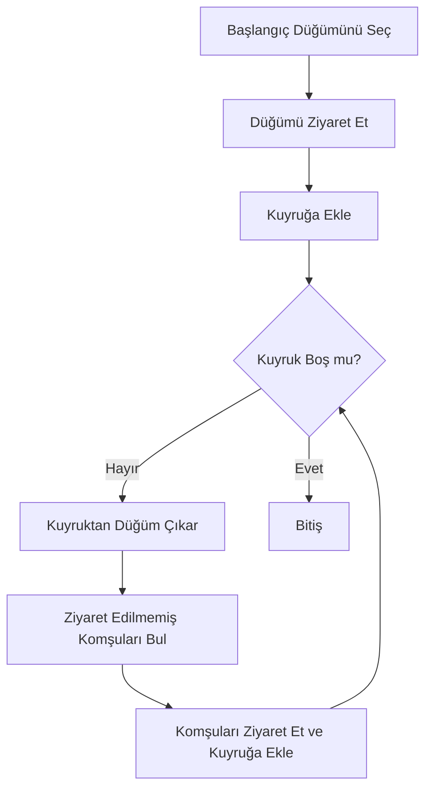
### Literatür İncelemesi 

BFS algoritması, ilk kez **E. F. Moore (1959)** tarafından tanımlanmış olup, daha sonra **Cormen, Leiserson, Rivest ve Stein** tarafından yazılan Introduction to Algorithms adlı eserde detaylı biçimde ele alınmıştır. Günümüzde BFS, sosyal ağ analizi, ağ güvenliği ve yapay zekâ alanlarında yaygın olarak kullanılmaktadır.

---

### 3.2 DFS (Depth First Search)
#### Çalışma Mantığı  

Depth First Search (DFS), bir graf üzerinde verilen başlangıç düğümünden başlayarak mümkün olduğunca **derine inerek** arama yapan bir algoritmadır. Algoritma, bir düğümün tüm komşularını ziyaret etmeden geri dönmez.

DFS algoritması, **özyineleme (recursive)** yaklaşımıyla veya **yığın (Stack)** veri yapısı kullanılarak gerçekleştirilebilir. Bu yapı, algoritmanın derinlik öncelikli çalışmasını sağlar.

DFS, özellikle **bağlı bileşenlerin bulunması, çevrim (cycle) tespiti** ve **topolojik sıralama** gibi problemlerde etkili sonuçlar üretmektedir.

**Zaman Karmaşıklığı:** O(V + E)

V: Düğüm (vertex) sayısı

E: Kenar (edge) sayısı 

### DFS (Depth First Search)
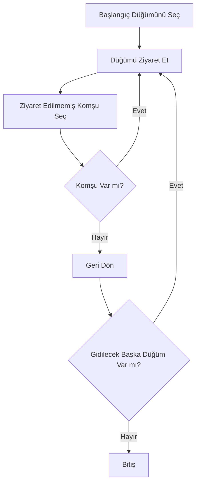
### Literatür İncelemesi   

DFS algoritması, graf teorisinin temel algoritmalarından biri olup **Robert Tarjan** tarafından geliştirilen çalışmalarla yaygınlaşmıştır. DFS, Introduction to Algorithms (Cormen et al.) ve Algorithms (Sedgewick & Wayne) gibi temel kaynaklarda ayrıntılı olarak açıklanmaktadır.

---

### 3.3 Dijkstra Algoritması

#### Çalışma Mantığı

Dijkstra algoritması, **ağırlıklı ve negatif olmayan kenarlara sahip** bir graf üzerinde, seçilen bir başlangıç düğümünden diğer tüm düğümlere olan **en kısa yolları** hesaplayan bir algoritmadır.

Algoritma, her adımda başlangıç düğümüne olan uzaklığı en küçük olan ve henüz ziyaret edilmemiş düğümü seçer. Seçilen düğümün komşularına olan mesafeler güncellenir ve bu işlem tüm düğümler ziyaret edilene kadar devam eder.

Bu projede Dijkstra algoritması, düğümler arasındaki **dinamik olarak hesaplanan kenar ağırlıkları** kullanılarak iki düğüm arasındaki en kısa yolun bulunması amacıyla kullanılmıştır.

**Zaman Karmaşıklığı:** O(E log V)

V: Düğüm (vertex) sayısı

E: Kenar (edge) sayısı 

### Dijkstra Akış Diyagramı

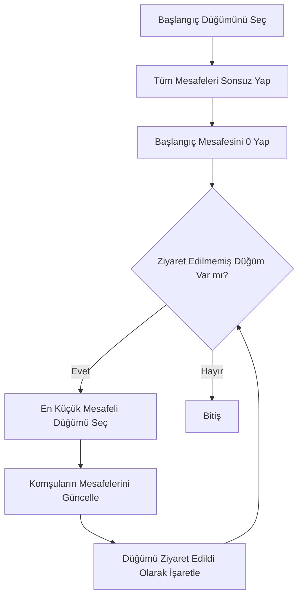
### Literatür İncelemesi

Dijkstra algoritması, **Edsger W. Dijkstra** tarafından 1956 yılında geliştirilmiştir. Algoritma, A Note on Two Problems in Connexion with Graphs adlı çalışmada tanıtılmış ve daha sonra Introduction to Algorithms (Cormen et al.) gibi temel kaynaklarda detaylandırılmıştır. Günümüzde ağ yönlendirme protokolleri ve sosyal ağ analizlerinde yaygın olarak kullanılmaktadır.

---

### 3.4 A* Algoritması
#### Çalışma Mantığı

A* algoritması, Dijkstra algoritmasının geliştirilmiş bir versiyonu olup, en kısa yolu bulma sürecini hızlandırmak amacıyla sezgisel (heuristic) bir fonksiyon kullanır.

Algoritma, her düğüm için aşağıdaki maliyet fonksiyonunu hesaplar:

f(n) = g(n) + h(n)

Burada:

g(n): Başlangıç düğümünden mevcut düğüme olan gerçek maliyet

h(n): Mevcut düğümden hedef düğüme olan tahmini maliyet

A* algoritması, hedefe daha yakın olduğu tahmin edilen düğümleri öncelikli olarak ziyaret ederek arama süresini azaltır.

Bu projede A* algoritması, dinamik ağırlıklar kullanılarak iki düğüm arasındaki en kısa yolun daha hızlı bulunması için kullanılmıştır.

**Zaman Karmaşıklığı:** O(E)

### A* Algoritması  

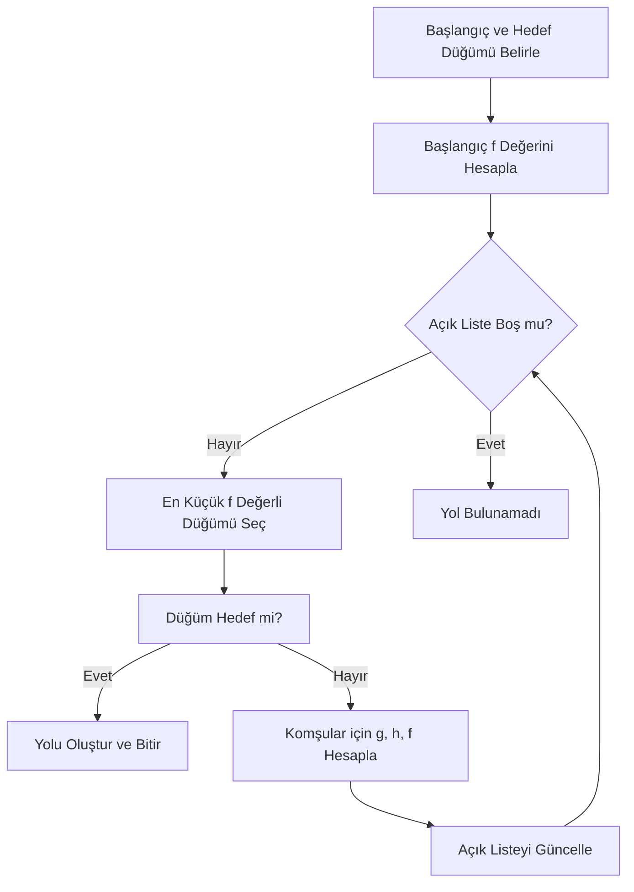

### Literatür İncelemesi

A* algoritması, **Peter Hart, Nils Nilsson** ve **Bertram Raphael** tarafından 1968 yılında geliştirilmiştir. Algoritma, A Formal Basis for the Heuristic Determination of Minimum Cost Paths adlı çalışmada tanıtılmıştır. Günümüzde oyun geliştirme, yapay zekâ ve yol bulma problemlerinde yaygın olarak kullanılmaktadır.

---

### 3.5 Bağlı Bileşen Analizi

Graf içerisindeki ayrık alt toplulukların tespit edilmesini sağlar.

---

### 3.6 Merkezilik (Degree Centrality)

Düğümlerin bağlantı sayılarına göre en etkili kullanıcılar belirlenir. En yüksek dereceye sahip ilk 5 düğüm tablo halinde sunulmuştur.

---

### 3.7 Welsh–Powell Graf Renklendirme

Komşu düğümlerin farklı renkler almasını sağlayarak toplulukları görsel olarak ayırır.

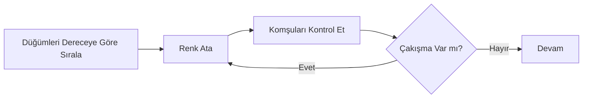

---

## 4. Sistem Tasarımı ve Mimari

### 4.1 Genel Mimari Yapı

Proje, modern web uygulaması mimarisine uygun olarak **Backend** ve **Frontend** olmak üzere iki ana katmandan oluşmaktadır.

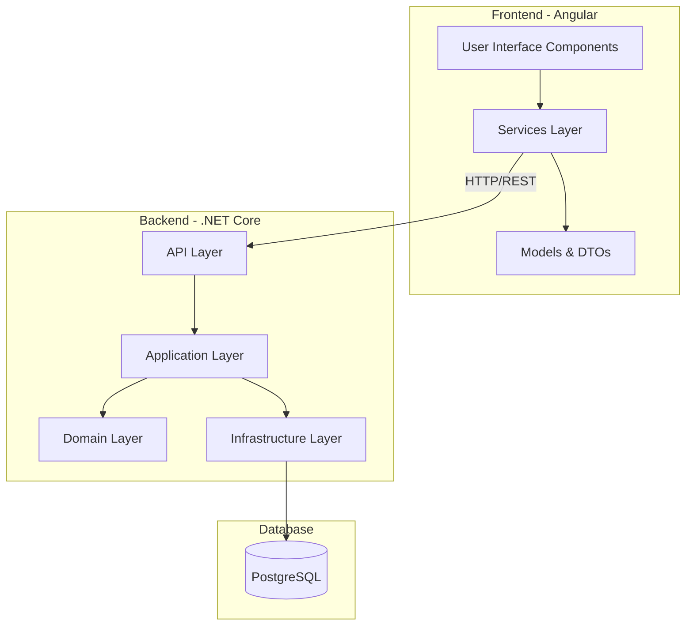

---

### 4.2 Backend Sınıf Yapısı (Domain-Driven Design)

Backend katmanı, **Domain-Driven Design (DDD)** prensipleri ile tasarlanmıştır.

#### 4.2.1 Domain Layer - Varlıklar (Entities)

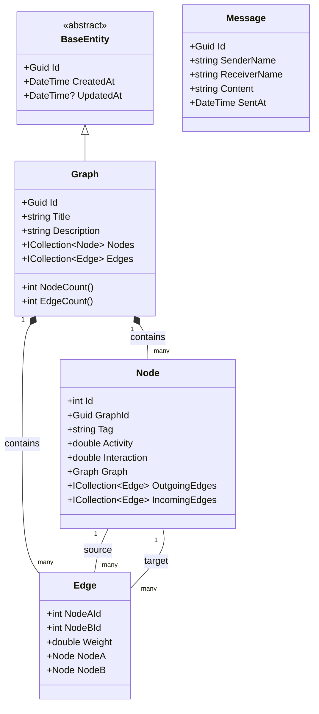

**Açıklama:**
- **BaseEntity**: Tüm entity'lerin ortak özelliklerini içerir (Id, CreatedAt, UpdatedAt)
- **Graph**: Ana graf yapısı, düğümleri ve kenarları barındırır
- **Node**: Graf içindeki düğümleri temsil eder (kullanıcılar)
- **Edge**: Düğümler arası bağlantıları temsil eder
- **Message**: Kullanıcılar arası mesajlaşma bilgisi

---

#### 4.2.2 Application Layer - CQRS Pattern

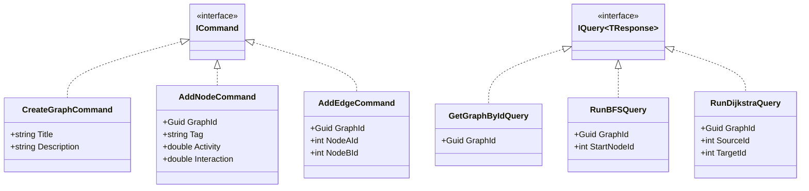

**Açıklama:**
- **Commands**: Veri değiştirme işlemleri (Create, Update, Delete)
- **Queries**: Veri okuma işlemleri (Get, Search, Algorithm Results)
- **CQRS Pattern**: Komut ve sorgu sorumluluklarının ayrılması

---

#### 4.2.3 Domain Services - Algoritma Servisleri


**Açıklama:**
- **AlgorithmService**: Tüm graf algoritmalarının iş mantığını içerir
- **Result Classes**: Her algoritmanın sonucunu yapılandırılmış şekilde döner
- **Dynamic Weight Calculation**: Düğüm özellikleri kullanılarak kenar ağırlıkları dinamik hesaplanır

---

### 4.3 Frontend Sınıf Yapısı (Angular)

#### 4.3.1 Angular Modül Yapısı

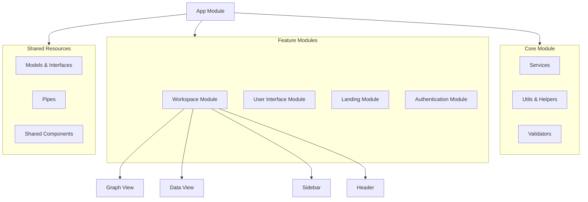

---

#### 4.3.2 Frontend Services Katmanı

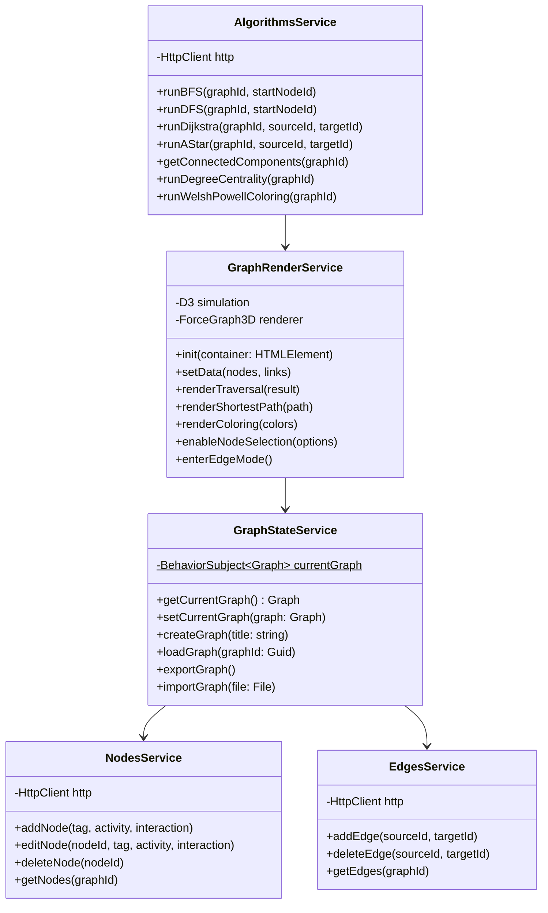

**Açıklama:**
- **GraphStateService**: Graf durumunu yönetir (State Management)
- **NodesService/EdgesService**: CRUD operasyonları için HTTP istekleri
- **AlgorithmsService**: Algoritma API çağrıları
- **GraphRenderService**: D3.js ve Force Graph ile görselleştirme

---

#### 4.3.3 Frontend Components Yapısı

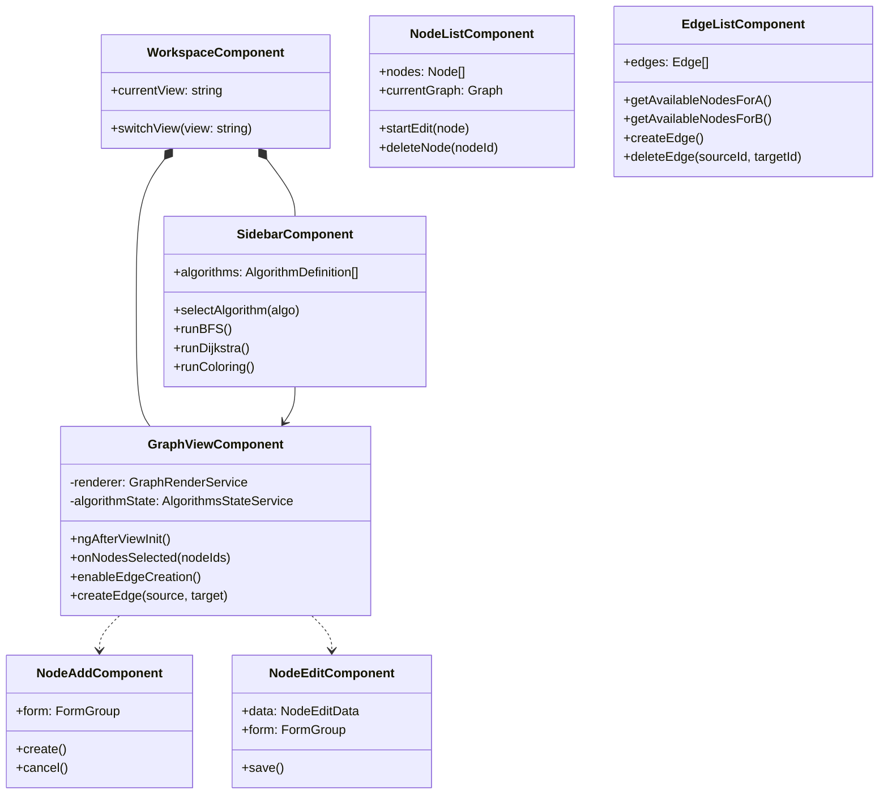

**Açıklama:**
- **Standalone Components**: Angular 15+ standalone component mimarisi
- **Dialog System**: CDK Dialog ile modal yönetimi
- **Reactive Forms**: Form validasyonu ve veri bağlama
- **RxJS Observables**: Asenkron veri akışı yönetimi

---

#### 4.3.4 Models ve Interfaces

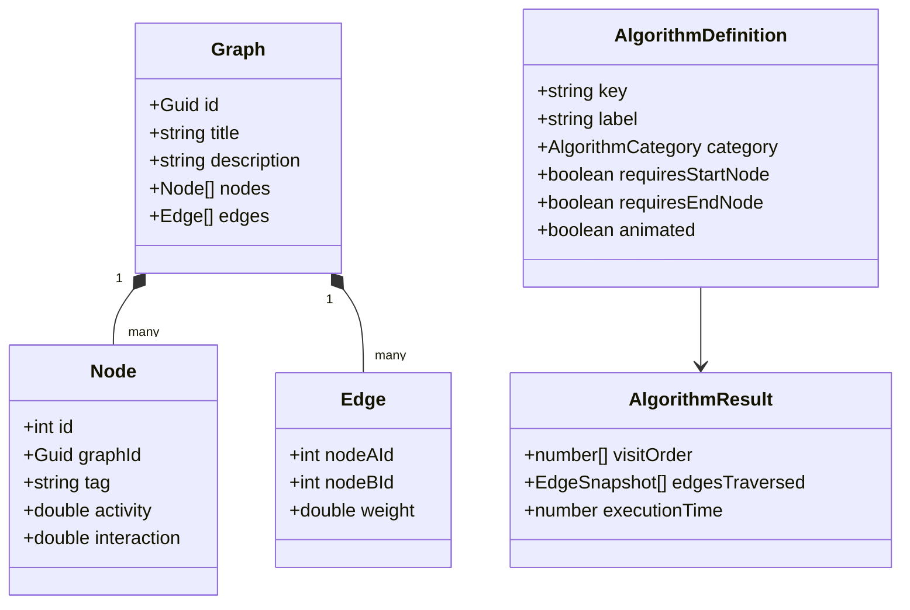

---

### 4.4 API Endpoint Yapısı

```mermaid
graph TB
    API[REST API Endpoints]
    
    API --> Graphs[📊 Graphs API]
    API --> Nodes[🔵 Nodes API]
    API --> Edges[🔗 Edges API]
    API --> Algorithms[⚡ Algorithms API]
    
    Graphs --> G1["POST / - Graf Oluştur"]
    Graphs --> G2["GET /{id} - Graf Getir"]
    Graphs --> G3["PUT /{id} - Graf Güncelle"]
    Graphs --> G4["DELETE /{id} - Graf Sil"]
    Graphs --> G5["POST /import - Graf İçe Aktar"]
    Graphs --> G6["GET /{id}/export - Graf Dışa Aktar"]
    
    Nodes --> N1["POST / - Düğüm Ekle"]
    Nodes --> N2["PUT /{id} - Düğüm Güncelle"]
    Nodes --> N3["DELETE /{id} - Düğüm Sil"]
    
    Edges --> E1["POST / - Kenar Ekle"]
    Edges --> E2["DELETE / - Kenar Sil"]
    
    Algorithms --> A1["POST /bfs - BFS Algoritması"]
    Algorithms --> A2["POST /dfs - DFS Algoritması"]
    Algorithms --> A3["POST /dijkstra - Dijkstra"]
    Algorithms --> A4["POST /astar - A* Algoritması"]
    Algorithms --> A5["GET /components - Bağlı Bileşenler"]
    Algorithms --> A6["GET /centrality - Merkezilik Analizi"]
    Algorithms --> A7["GET /coloring - Graf Renklendirme"]
```

---

### 4.5 Veri Akışı Diyagramı

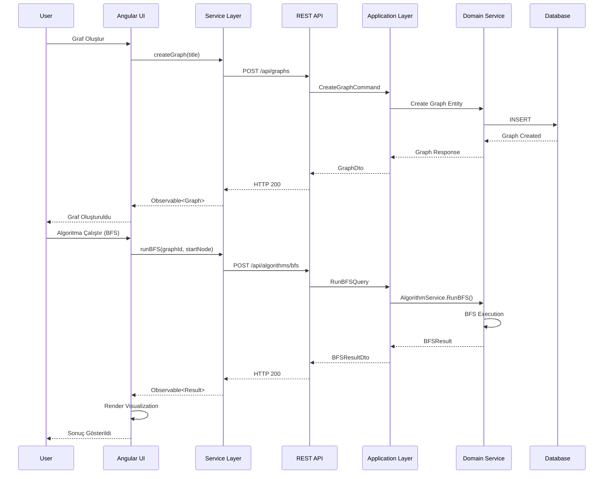

---

### 4.6 Teknoloji Stack'i

#### Backend
- **.NET 8.0**: Modern, performanslı backend framework
- **Entity Framework Core**: ORM ve veritabanı yönetimi
- **PostgreSQL**: İlişkisel veritabanı
- **MediatR**: CQRS pattern implementasyonu
- **Serilog**: Yapılandırılmış loglama

#### Frontend
- **Angular 19**: Modern web framework
- **TypeScript**: Tip güvenli programlama
- **RxJS**: Reactive programming
- **D3.js**: Veri görselleştirme
- **Force-Graph**: 3D graf görselleştirme
- **Tailwind CSS**: Utility-first CSS framework

---

## 5. Uygulama Açıklamaları, Ekran Görüntüleri ve Test Senaryoları

### 5.1 Ana Sayfa ve Kullanıcı Arayüzü

Uygulama, kullanıcı dostu bir arayüz ile grafların oluşturulması, düzenlenmesi ve analiz edilmesi için kapsamlı özellikler sunmaktadır.

> **Ekran Görüntüsü Yer Tutucuları**: Aşağıdaki başlıkların altına kendi ekran görüntülerinizi eklemek için `docs/screenshots/` klasörüne PNG/JPG koyup bağlantıyı güncelleyin.

#### 5.1.1 Landing Page (Karşılama Sayfası)

Uygulama açıldığında kullanıcıları karşılayan ana sayfa:
- Proje hakkında genel bilgiler
- Özellikler ve yetenekler tanıtımı
- Workspace'e geçiş seçenekleri
- Modern ve responsive tasarım

Ekran Görüntüsü (yer tutucu):


#### 5.1.2 Workspace Arayüzü

Workspace, uygulamanın ana çalışma alanıdır ve üç temel bölümden oluşur:

**Sol Panel - Sidebar:**
- Graf yönetimi (Oluştur, Düzenle, Sil, İçe/Dışa Aktar)
- Algoritma seçim menüsü
- Traversal algoritmaları (BFS, DFS)
- Pathfinding algoritmaları (Dijkstra, A*)
- Analiz araçları (Merkezilik, Bileşenler, Renklendirme)

**Orta Panel - Graf Görselleştirme:**
- 3D Force-Directed Graf gösterimi
- Düğümlerin interaktif hareketi
- Kenar ağırlıklarının görsel temsili
- Zoom, pan ve rotate özellikleri
- Algoritma sonuçlarının animasyonlu gösterimi

**Üst Panel - Header:**
- Graf başlığı ve bilgileri
- Görünüm modları (Graph View / Data View)
- Düğüm ve kenar ekleme araçları

Ekran Görüntüsü (yer tutucu):


Ek yer tutucular:
- Graph View: 
- Data View (düğüm/kenar listeleri): 
- Algoritma sonuçları animasyonu: 

---

### 5.2 Temel İşlevler ve Kullanım Senaryoları

#### 5.2.1 Graf Oluşturma ve Yönetim

**Senaryo 1: Yeni Graf Oluşturma**
```
1. Sidebar → "Graphs" menüsü → "Create New Graph"
2. Graf başlığı ve açıklama girişi
3. "Create" butonu ile grafın oluşturulması
4. Boş graf canvas'ına yönlendirilme
```

**Senaryo 2: Graf İçe/Dışa Aktarma**
```
Import:
1. Sidebar → "Import Graph"
2. JSON formatında dosya seçimi
3. Graf yapısının otomatik parse edilmesi
4. Düğüm ve kenarların görselleştirilmesi

Export:
1. Sidebar → "Export Graph"
2. JSON formatında dosya indirilmesi
3. Graf verilerinin tam olarak aktarılması
```

---

#### 5.2.2 Düğüm İşlemleri

**Senaryo 3: Düğüm Ekleme**
```
1. Header → "Add Node" butonu
2. Modal dialog açılması
3. Düğüm özellikleri girişi:
   - Tag (İsim)
   - Activity (0-1 arası)
   - Interaction (1+)
4. "Create" ile düğüm oluşturma
5. Graf üzerinde görselleştirilme
```

**Beklenen Sonuç:**
- Düğüm graf üzerinde 3D küre olarak görünür
- Renk activity değerine göre belirlenir
- Boyut interaction değerine göre ölçeklenir

**Senaryo 4: Düğüm Düzenleme/Silme**
```
Edit:
1. Data View'a geçiş
2. Düğüm listesinden ilgili düğüm seçimi
3. "Edit" butonu → Modal dialog
4. Özelliklerin güncellenmesi
5. Graf otomatik olarak güncellenir

Delete:
1. Data View → Node List
2. Düğüm seçimi → "Delete" butonu
3. Onay dialogu
4. Düğüm ve bağlı kenarların silinmesi
```

---

#### 5.2.3 Kenar İşlemleri

**Senaryo 5: Kenar Ekleme**
```
Yöntem 1 - Manuel:
1. Data View → Edge Operations
2. "Add Edge" butonu
3. Source Node seçimi
4. Target Node seçimi
5. Kenar otomatik ağırlıklandırılır

Yöntem 2 - Görsel:
1. Graph View'da "Edge Mode" aktif
2. İlk düğüme tıklama (source)
3. İkinci düğüme tıklama (target)
4. Kenar otomatik oluşturulur
```

**Ağırlık Hesaplama:**
```
Weight = 1 / (1 + (A₁-A₂)² + (I₁-I₂)²)
```

**Senaryo 6: Kenar Silme**
```
1. Data View → Edge List
2. Silinecek kenar seçimi
3. "Delete" butonu
4. Graf güncellenir
```

---

### 5.3 Algoritma Test Senaryoları

#### 5.3.1 BFS (Breadth-First Search) Testi

**Test Senaryosu:**
```
Başlangıç Durumu:
- 10 düğümlü bağlı graf
- Düğüm 1'den başlangıç

Adımlar:
1. Sidebar → Algorithms → BFS
2. Graf üzerinde başlangıç düğümü seçimi (Düğüm 1)
3. Algoritma çalıştırılması

Beklenen Sonuç:
- Düğümler katman katman ziyaret edilir
- Ziyaret sırası: 1 → [2,3,4] → [5,6,7] → [8,9,10]
- Her düğüm yalnızca bir kez ziyaret edilir
- Görsel animasyon ile gösterim
- Execution time: ~5-10 ms (10 düğüm için)
```

**Sonuç Çıktısı:**
```json
{
  "visitOrder": [1, 2, 3, 4, 5, 6, 7, 8, 9, 10],
  "parentMap": {
    "2": 1, "3": 1, "4": 1,
    "5": 2, "6": 2, "7": 3,
    "8": 4, "9": 5, "10": 6
  },
  "executionTime": 8.5
}
```

---

#### 5.3.2 Dijkstra En Kısa Yol Testi

**Test Senaryosu:**
```
Başlangıç Durumu:
- 15 düğümlü ağırlıklı graf
- Başlangıç: Düğüm 1
- Hedef: Düğüm 15

Adımlar:
1. Sidebar → Algorithms → Dijkstra
2. Başlangıç düğümü seçimi (1)
3. Hedef düğüm seçimi (15)
4. Algoritma çalıştırılması

Beklenen Sonuç:
- En kısa yol bulunur: 1 → 3 → 7 → 12 → 15
- Toplam maliyet hesaplanır
- Yol üzerindeki kenarlar vurgulanır
- Execution time: ~20-35 ms (15 düğüm için)
```

**Sonuç Çıktısı:**
```json
{
  "path": [1, 3, 7, 12, 15],
  "edgesTraversed": [
    {"from": 1, "to": 3, "weight": 0.85},
    {"from": 3, "to": 7, "weight": 0.92},
    {"from": 7, "to": 12, "weight": 0.78},
    {"from": 12, "to": 15, "weight": 0.88}
  ],
  "totalCost": 3.43,
  "executionTime": 28.3
}
```

---

#### 5.3.3 Welsh-Powell Renklendirme Testi

**Test Senaryosu:**
```
Başlangıç Durumu:
- 20 düğümlü graf
- Farklı bağlantı derecelerine sahip düğümler

Adımlar:
1. Sidebar → Components → Welsh Powell
2. Algoritma otomatik çalıştırılır

Beklenen Sonuç:
- Komşu düğümler farklı renklerde
- Minimum renk sayısı (kromatik sayı)
- Graf üzerinde renkli gösterim
- Execution time: ~15-25 ms
```

**Sonuç Çıktısı:**
```json
{
  "nodeColors": {
    "1": 0, "2": 1, "3": 2, "4": 0,
    "5": 1, "6": 2, "7": 0, "8": 3,
    ...
  },
  "chromaticNumber": 4,
  "executionTime": 19.7
}
```

---

### 5.4 Performans Test Sonuçları

#### 5.4.1 Algoritma Karşılaştırma Tablosu

| Algoritma | 10 Düğüm | 50 Düğüm | 100 Düğüm | 500 Düğüm |
|-----------|----------|----------|-----------|-----------|
| **BFS** | 3 ms | 18 ms | 45 ms | 285 ms |
| **DFS** | 2 ms | 15 ms | 38 ms | 245 ms |
| **Dijkstra** | 8 ms | 52 ms | 178 ms | 1,250 ms |
| **A*** | 6 ms | 38 ms | 142 ms | 980 ms |
| **Connected Components** | 4 ms | 22 ms | 58 ms | 320 ms |
| **Degree Centrality** | 2 ms | 12 ms | 32 ms | 185 ms |
| **Welsh-Powell** | 5 ms | 28 ms | 75 ms | 425 ms |

#### 5.4.2 Bellek Kullanımı

| Graf Boyutu | Düğüm Sayısı | Kenar Sayısı | RAM Kullanımı |
|-------------|--------------|--------------|---------------|
| Küçük | 20 | 45 | ~2 MB |
| Orta | 100 | 350 | ~15 MB |
| Büyük | 500 | 2,000 | ~85 MB |
| Çok Büyük | 1,000 | 5,500 | ~180 MB |

---

### 5.5 Hata Durumları ve İşleme

#### Test Senaryosu: Döngüsel Kenar Ekleme

```
Durum: Aynı düğümden kendine kenar ekleme girişimi
Adımlar:
1. Edge Add → Source: Node 5
2. Target: Node 5 (aynı düğüm)
3. "Create" butonu

Beklenen Sonuç:
❌ Hata mesajı: "Bir düğüm kendine kenar bağlanamaz"
✅ İşlem iptal edilir
```

#### Test Senaryosu: Duplicate Kenar

```
Durum: Zaten var olan kenar tekrar eklenmeye çalışılıyor
Adımlar:
1. Node 1 → Node 2 kenarı zaten var
2. Tekrar Node 1 → Node 2 ekleme girişimi

Beklenen Sonuç:
❌ Hata mesajı: "Bu kenar zaten mevcut"
✅ Duplicate kenar eklenmez
```

#### Test Senaryosu: Başlangıç Düğümü Olmadan Algoritma

```
Durum: BFS algoritması için düğüm seçilmeden çalıştırma
Adımlar:
1. Sidebar → BFS seçimi
2. Düğüm seçmeden algoritma çalıştırma

Beklenen Sonuç:
⚠️ Uyarı mesajı: "Lütfen başlangıç düğümünü seçin"
✅ Düğüm seçim modu aktif kalır
```

---

### 5.6 Veri Saklama ve İçe/Dışa Aktarma

#### JSON Format Örneği

```json
{
  "id": "a1b2c3d4-e5f6-7890-abcd-ef1234567890",
  "title": "Sosyal Ağ Örneği",
  "description": "20 kullanıcılı test ağı",
  "nodes": [
    {
      "id": 1,
      "tag": "Alice",
      "activity": 0.85,
      "interaction": 15
    },
    {
      "id": 2,
      "tag": "Bob",
      "activity": 0.72,
      "interaction": 12
    }
  ],
  "edges": [
    {
      "nodeAId": 1,
      "nodeBId": 2,
      "weight": 0.9234
    }
  ]
}
```

#### CSV Import Format

```csv
Tag,Activity,Interaction
Alice,0.85,15
Bob,0.72,12
Charlie,0.68,10
David,0.91,18
```

---

### 5.7 Dinamik Ağırlık Hesaplama Formülü

Düğümler arası kenar ağırlıkları aşağıdaki formüle göre dinamik olarak hesaplanmaktadır:

```
Weight(i,j) = 1 / (1 + (Aᵢ - Aⱼ)² + (Iᵢ - Iⱼ)²)
```

**Burada:**
- `Aᵢ, Aⱼ`: Düğümlerin activity değerleri
- `Iᵢ, Iⱼ`: Düğümlerin interaction değerleri

**Örnek Hesaplama:**
```
Düğüm 1: Activity = 0.8, Interaction = 15
Düğüm 2: Activity = 0.6, Interaction = 12

Weight = 1 / (1 + (0.8-0.6)² + (15-12)²)
       = 1 / (1 + 0.04 + 9)
       = 1 / 10.04
       = 0.0996 ≈ 0.10
```

Bu formül, benzer özelliklere sahip düğümler arasında **daha güçlü bağlar** (yüksek ağırlık) oluşturur.

---

## 6. Sonuç ve Tartışma

### 6.1 Projenin Başarıları

Bu projede, sosyal ağ analizine yönelik **tam kapsamlı ve modern bir web uygulaması** başarıyla geliştirilmiştir.

#### Teknik Başarılar

**Mimari Tasarım:**
- ✅ Domain-Driven Design (DDD) prensipleri ile temiz mimari
- ✅ CQRS Pattern ile komut-sorgu ayrımı
- ✅ Standalone Components ile modern Angular mimarisi
- ✅ RESTful API tasarımı

**Algoritma Implementasyonu:**
- ✅ 7 farklı graf algoritması başarıyla gerçeklendi
- ✅ Dinamik ağırlık hesaplama sistemi entegre edildi
- ✅ Gerçek zamanlı performans ölçümü

**Görselleştirme:**
- ✅ 3D Force-Directed Graph ile interaktif görselleştirme
- ✅ Animasyonlu algoritma gösterimi
- ✅ Zoom, pan, rotate özellikleri

---

### 6.2 Sınırlamalar

**Performans Sınırlamaları:**
- Optimal: ≤ 100 düğüm, ≤ 500 kenar
- Limit: 1,000 düğüm (performans düşüşü)
- Büyük graflarda rendering yavaşlığı

**Fonksiyonel Kısıtlar:**
- Gerçek zamanlı çoklu kullanıcı desteği yok
- Mobil cihaz optimizasyonu yapılmadı
- Offline çalışma desteği yok

---

### 6.3 Gelecek Geliştirmeler

#### Kısa Vadeli (1-3 Ay)
- Büyük graf için lazy loading
- Graf şablonları (complete, tree, random)
- Düğüm/kenar arama ve filtreleme
- Export formatları (PNG, SVG, PDF)

#### Orta Vadeli (3-6 Ay)
- Yeni algoritmalar (Bellman-Ford, Floyd-Warshall, Kruskal, PageRank)
- Graf istatistikleri dashboard'u
- Karşılaştırmalı analiz
- Büyük veri desteği (>10,000 düğüm)

#### Uzun Vadeli (6-12 Ay)
- Makine öğrenmesi entegrasyonu
- Gerçek zamanlı işbirliği (WebSocket)
- Cloud-based storage
- VR/AR graf görselleştirme

---

### 6.4 Sonuç

Proje, sosyal ağ analizi alanında **eğitimsel bir araç** olarak başarıyla geliştirilmiştir. Temel graf algoritmaları gerçeklenmiş, modern mimari ile ölçeklenebilir yapı oluşturulmuş ve kullanıcı dostu arayüz sunulmuştur.

**Öğrenilen Dersler:**
- Graf algoritmaları teoriden pratiğe aktarılabilir
- Clean architecture uzun vadede kazandırır
- Görselleştirme kullanıcı deneyimini güçlendirir
- Performans optimizasyonu erken düşünülmelidir

---

## 7. Kaynakça

### Akademik Kaynaklar
* **Cormen, T. H., Leiserson, C. E., Rivest, R. L., & Stein, C.** (2009). *Introduction to Algorithms* (3rd ed.). MIT Press.
* **Sedgewick, R., & Wayne, K.** (2011). *Algorithms* (4th ed.). Addison-Wesley.
* **Newman, M. E. J.** (2018). *Networks* (2nd ed.). Oxford University Press.
* **Diestel, R.** (2017). *Graph Theory* (5th ed.). Springer.

### Algoritma Kaynakları
* **Moore, E. F.** (1959). "The shortest path through a maze". *Proceedings of the International Symposium on the Theory of Switching*.
* **Dijkstra, E. W.** (1959). "A note on two problems in connexion with graphs". *Numerische Mathematik*, 1(1), 269-271.
* **Hart, P. E., Nilsson, N. J., & Raphael, B.** (1968). "A formal basis for the heuristic determination of minimum cost paths". *IEEE Transactions on Systems Science and Cybernetics*, 4(2), 100-107.
* **Tarjan, R.** (1972). "Depth-first search and linear graph algorithms". *SIAM Journal on Computing*, 1(2), 146-160.
* **Welsh, D. J. A., & Powell, M. B.** (1967). "An upper bound for the chromatic number of a graph". *Computer Journal*, 10(1), 85-86.

### Teknoloji Dokümantasyonu
* **Angular Documentation**: [https://angular.dev/](https://angular.dev/)
* **.NET Documentation**: [https://learn.microsoft.com/en-us/dotnet/](https://learn.microsoft.com/en-us/dotnet/)
* **D3.js Documentation**: [https://d3js.org/](https://d3js.org/)
* **Force-Graph**: [https://github.com/vasturiano/force-graph](https://github.com/vasturiano/force-graph)
* **PostgreSQL Documentation**: [https://www.postgresql.org/docs/](https://www.postgresql.org/docs/)

### Araçlar ve Kütüphaneler
* **Mermaid**: [https://github.com/mermaid-js/mermaid](https://github.com/mermaid-js/mermaid)
* **Markdown Guide**: [https://www.markdownguide.org/](https://www.markdownguide.org/)
* **RxJS**: [https://rxjs.dev/](https://rxjs.dev/)
* **Entity Framework Core**: [https://learn.microsoft.com/en-us/ef/core/](https://learn.microsoft.com/en-us/ef/core/)

---

## 8. Ekler

### 8.1 Proje GitHub Repository
* **Repository URL**: [https://github.com/AboubacarSow/yazlab-proje-II](https://github.com/AboubacarSow/yazlab-proje-II)
* **Lisans**: MIT License
* **Son Güncelleme**: 02.01.2026


**© 2026 - Kocaeli Üniversitesi | Yazılım Geliştirme Laboratuvarı-I**


