<!-- PROJECT SHIELDS -->
[![Contributors][contributors-shield]][contributors-url]
[![Forks][forks-shield]][forks-url]
[![Stars][stars-shield]][stars-url]

<!-- BADGE LINKS -->
[contributors-shield]: https://img.shields.io/github/contributors/AboubacarSow/yazlab-proje-II?style=for-the-badge
[contributors-url]: https://github.com/AboubacarSow/yazlab-proje-II/graphs/contributors

[forks-shield]: https://img.shields.io/github/forks/AboubacarSow/yazlab-proje-II?style=for-the-badge
[forks-url]: https://github.com/AboubacarSow/yazlab-proje-II/network/members

[stars-shield]: https://img.shields.io/github/stars/AboubacarSow/yazlab-proje-II?style=for-the-badge
[stars-url]: https://github.com/AboubacarSow/yazlab-proje-II/stargazers


# Sosyal Ağ Analizi Uygulaması
**Üniversite:** Kocaeli Üniversitesi  
**Bölüm:** Bilişim Sistemleri Mühendisliği – Teknoloji Fakültesi   
**Ders:** Yazılım Geliştirme Laboratuvarı-I  
**Proje:** Proje – 2  
**Tarih:** 02.01.2026

### 👥 Ekip Üyeleri

| İsim Soyisim        | Öğrenci Numarası |  
|---------------------|------------------|
| Emre Yasin Yıldan   | 231307058        |
| Aboubacar Sow       | 221307117        |


---

## 1. Giriş

Sosyal ağlar, bireyler veya varlıklar arasındaki ilişkilerin modellenmesi ve analiz edilmesi açısından önemli veri kaynaklarıdır. Bu projede, kullanıcılar arasındaki ilişkileri bir **graf veri yapısı** ile temsil eden ve çeşitli **graf algoritmaları** yardımıyla bu yapıyı analiz eden etkileşimli bir **Sosyal Ağ Analizi Uygulaması** geliştirilmiştir.

Projenin temel amacı; graf teorisi, algoritma analizi, nesne yönelimli programlama (OOP), veri saklama ve görselleştirme konularının bütünleşik olarak uygulanmasıdır.

---

## 2. Problemin Tanımı ve Amaç

Problem, kullanıcılar ve aralarındaki etkileşimlerden oluşan bir sosyal ağın dinamik olarak yönetilmesi ve analiz edilmesidir. Kullanıcıların:

* Ağ üzerindeki konumları,
* Birbirleriyle olan mesafeleri,
* Topluluk yapıları,
* En etkili düğümleri

graf algoritmaları yardımıyla belirlenmektedir.

Amaç, bu analizleri hem **görsel** hem de **sayısal** olarak sunabilen, kullanıcı etkileşimine açık bir yazılım geliştirmektir.

---

## 3. Kullanılan Algoritmalar

### 3.1 BFS (Breadth First Search)
#### Çalışma Mantığı    

Breadth First Search (BFS), bir graf üzerinde seçilen başlangıç düğümünden itibaren düğümleri **katman (seviye)** bazlı olarak ziyaret eden bir arama algoritmasıdır. Algoritma, başlangıç düğümüne en yakın düğümleri önce ziyaret eder ve daha sonra bir sonraki seviyeye geçer.

BFS algoritması, ziyaret sırasını koruyabilmek için **kuyruk (Queue)** veri yapısını kullanır. Her düğüm yalnızca bir kez ziyaret edilir ve ziyaret edilen düğümlerin komşuları sırayla kuyruğa eklenir.

Bu özellikleri sayesinde BFS, özellikle **erişilebilirlik analizi** ve **ağırlıksız graflarda en kısa yolun bulunması** problemlerinde etkin bir şekilde kullanılmaktadır.


**Zaman Karmaşıklığı:** O(V + E)
Burada:

V: Düğüm (vertex) sayısı

E: Kenar (edge) sayısı

### BFS (Breadth First Search)

### Literatür İncelemesi 

BFS algoritması, ilk kez **E. F. Moore (1959)** tarafından tanımlanmış olup, daha sonra **Cormen, Leiserson, Rivest ve Stein** tarafından yazılan Introduction to Algorithms adlı eserde detaylı biçimde ele alınmıştır. Günümüzde BFS, sosyal ağ analizi, ağ güvenliği ve yapay zekâ alanlarında yaygın olarak kullanılmaktadır.

---

### 3.2 DFS (Depth First Search)
#### Çalışma Mantığı  

Depth First Search (DFS), bir graf üzerinde verilen başlangıç düğümünden başlayarak mümkün olduğunca **derine inerek** arama yapan bir algoritmadır. Algoritma, bir düğümün tüm komşularını ziyaret etmeden geri dönmez.

DFS algoritması, **özyineleme (recursive)** yaklaşımıyla veya **yığın (Stack)** veri yapısı kullanılarak gerçekleştirilebilir. Bu yapı, algoritmanın derinlik öncelikli çalışmasını sağlar.

DFS, özellikle **bağlı bileşenlerin bulunması, çevrim (cycle) tespiti** ve **topolojik sıralama** gibi problemlerde etkili sonuçlar üretmektedir.

**Zaman Karmaşıklığı:** O(V + E)

V: Düğüm (vertex) sayısı

E: Kenar (edge) sayısı 

### DFS (Depth First Search)

```mermaid
flowchart TD
    A[Başlangıç Düğümünü Seç] --> B[Düğümü Ziyaret Et]
    B --> C[Ziyaret Edilmemiş Komşu Seç]
    C --> D{Komşu Var mı?}
    D -->|Evet| B
    D -->|Hayır| E[Geri Dön]
    E --> F{Gidilecek Başka Düğüm Var mı?}
    F -->|Evet| B
    F -->|Hayır| G[Bitiş]
```

### Literatür İncelemesi   

DFS algoritması, graf teorisinin temel algoritmalarından biri olup **Robert Tarjan** tarafından geliştirilen çalışmalarla yaygınlaşmıştır. DFS, Introduction to Algorithms (Cormen et al.) ve Algorithms (Sedgewick & Wayne) gibi temel kaynaklarda ayrıntılı olarak açıklanmaktadır.

---

### 3.3 Dijkstra Algoritması

#### Çalışma Mantığı

Dijkstra algoritması, **ağırlıklı ve negatif olmayan kenarlara sahip** bir graf üzerinde, seçilen bir başlangıç düğümünden diğer tüm düğümlere olan **en kısa yolları** hesaplayan bir algoritmadır.

Algoritma, her adımda başlangıç düğümüne olan uzaklığı en küçük olan ve henüz ziyaret edilmemiş düğümü seçer. Seçilen düğümün komşularına olan mesafeler güncellenir ve bu işlem tüm düğümler ziyaret edilene kadar devam eder.

Bu projede Dijkstra algoritması, düğümler arasındaki **dinamik olarak hesaplanan kenar ağırlıkları** kullanılarak iki düğüm arasındaki en kısa yolun bulunması amacıyla kullanılmıştır.

**Zaman Karmaşıklığı:** O(E log V)

V: Düğüm (vertex) sayısı

E: Kenar (edge) sayısı 

### Dijkstra Akış Diyagramı

```mermaid
flowchart TD
    A[Başlangıç Düğümünü Seç] --> B[Tüm Mesafeleri Sonsuz Yap]
    B --> C[Başlangıç Mesafesini 0 Yap]
    C --> D{Ziyaret Edilmemiş Düğüm Var mı?}
    D -->|Evet| E[En Küçük Mesafeli Düğümü Seç]
    E --> F[Komşuların Mesafelerini Güncelle]
    F --> G[Düğümü Ziyaret Edildi Olarak İşaretle]
    G --> D
    D -->|Hayır| H[Bitiş]
```


### Literatür İncelemesi

Dijkstra algoritması, **Edsger W. Dijkstra** tarafından 1956 yılında geliştirilmiştir. Algoritma, A Note on Two Problems in Connexion with Graphs adlı çalışmada tanıtılmış ve daha sonra Introduction to Algorithms (Cormen et al.) gibi temel kaynaklarda detaylandırılmıştır. Günümüzde ağ yönlendirme protokolleri ve sosyal ağ analizlerinde yaygın olarak kullanılmaktadır.

---

### 3.4 A* Algoritması
#### Çalışma Mantığı

A* algoritması, Dijkstra algoritmasının geliştirilmiş bir versiyonu olup, en kısa yolu bulma sürecini hızlandırmak amacıyla sezgisel (heuristic) bir fonksiyon kullanır.

Algoritma, her düğüm için aşağıdaki maliyet fonksiyonunu hesaplar:

f(n) = g(n) + h(n)

Burada:

g(n): Başlangıç düğümünden mevcut düğüme olan gerçek maliyet

h(n): Mevcut düğümden hedef düğüme olan tahmini maliyet

A* algoritması, hedefe daha yakın olduğu tahmin edilen düğümleri öncelikli olarak ziyaret ederek arama süresini azaltır.

Bu projede A* algoritması, dinamik ağırlıklar kullanılarak iki düğüm arasındaki en kısa yolun daha hızlı bulunması için kullanılmıştır.

**Zaman Karmaşıklığı:** O(E)

### A* Algoritması  

```mermaid
flowchart TD

    A[Başlangıç ve Hedef Düğümü Belirle] --> B[Başlangıç f Değerini Hesapla] 
    B --> C{Açık Liste Boş mu?}  
    C -->|Hayır| D[En Küçük f Değerli Düğümü Seç]
    D --> E[Düğüm Hedef mi?]
    E -->|Evet| F[Yolu OluÅŸtur ve Bitir]
    E -->|Hayır| G[Komşular için g, h, f Hesapla]
    G --> H[Açık Listeyi Güncelle]
    H --> C
    C -->|Evet| I[Yol Bulunamadı]
```



### Literatür İncelemesi

A* algoritması, **Peter Hart, Nils Nilsson** ve **Bertram Raphael** tarafından 1968 yılında geliştirilmiştir. Algoritma, A Formal Basis for the Heuristic Determination of Minimum Cost Paths adlı çalışmada tanıtılmıştır. Günümüzde oyun geliştirme, yapay zekâ ve yol bulma problemlerinde yaygın olarak kullanılmaktadır.

---

### 3.5 Bağlı Bileşen Analizi

Graf içerisindeki ayrık alt toplulukların tespit edilmesini sağlar.

---

### 3.6 Merkezilik (Degree Centrality)

Düğümlerin bağlantı sayılarına göre en etkili kullanıcılar belirlenir. En yüksek dereceye sahip ilk 5 düğüm tablo halinde sunulmuştur.

---

### 3.7 Welsh–Powell Graf Renklendirme

Komşu düğümlerin farklı renkler almasını sağlayarak toplulukları görsel olarak ayırır.

```mermaid
flowchart LR
A[Düğümleri Dereceye Göre Sırala] --> B[Renk Ata]
B --> C[Komşuları Kontrol Et]
C --> D{Çakışma Var mı?}
D -->|Evet| B
D -->|Hayır| E[Devam]
```



---

## 4. Sistem Tasarımı

### 4.1 Sınıf Diyagramı

  +int id
  +double aktiflik
  +double etkilesim
  +Node from
  +Node to
  +double weight
  +List<Node> nodes
  +List<Edge> edges
  +run()
  +colorGraph()


---

## 5. Veri Saklama ve Dinamik Ağırlık Hesaplama

Veriler JSON ve CSV formatında saklanmaktadır. Düğümler arası kenar ağırlıkları aşağıdaki formüle göre dinamik olarak hesaplanmaktadır:

```
Ağırlık(i,j) = 1 / (1 + (Ai-Aj)^2 + (Ei-Ej)^2 + (Bi-Bj)^2)
```

Bu yapı sayesinde benzer özelliklere sahip düğümler arasında daha güçlü bağlar oluşturulmaktadır.

---

## 6. Kullanıcı Arayüzü

* Canvas tabanlı grafik gösterimi
* Düğüm ve kenar ekleme/silme
* Algoritmaların tek tek çalıştırılması
* Sonuçların tablo ve grafik olarak sunulması

---

## 7. Testler ve Performans Analizi

| Algoritma | Düğüm Sayısı | Süre (ms) |
| --------- | ------------ | --------- |
| BFS       | 20           | 5         |
| DFS       | 20           | 4         |
| Dijkstra  | 50           | 30        |
| A*        | 50           | 22        |

Algoritmalar küçük ve orta ölçekli graflarda makul sürelerde çalışmıştır.

---

## 8. Sonuç ve Tartışma

Bu projede, sosyal ağ analizine yönelik kapsamlı bir uygulama geliştirilmiştir. Graf algoritmaları başarıyla uygulanmış, görselleştirme ile desteklenmiştir.

### Başarılar

* OOP prensiplerine uygun mimari
* Dinamik ağırlık hesaplama
* Etkileşimli kullanıcı arayüzü

### Sınırlılıklar

* Büyük ölçekli graflarda performans sınırlamaları

### Gelecek Çalışmalar

* Daha büyük veri setleri için optimizasyon
* Merkeziyet ölçütlerinin çeşitlendirilmesi
* Web tabanlı sürüm geliştirilmesi

---

## 9. Kaynakça

* [https://github.com/mermaid-js/mermaid](https://github.com/mermaid-js/mermaid)
* [https://www.markdownguide.org/](https://www.markdownguide.org/)
* Graf Teorisi ve Algoritmalar – Cormen et al.

