# 📸 Sosyal Ağ Analizi Uygulaması - Ekran Görüntüleri

Uygulamanın farklı bölümlerinden alınan ekran görüntüleri aşağıda gösterilmektedir.

---

## 🏠 Landing Page (Karşılama Sayfası)

Uygulamanın karşılama sayfası ve kullanıcı arayüzü bileşenleri:

### Ana Sayfa

Proje tanıtımı ve genel bakış:

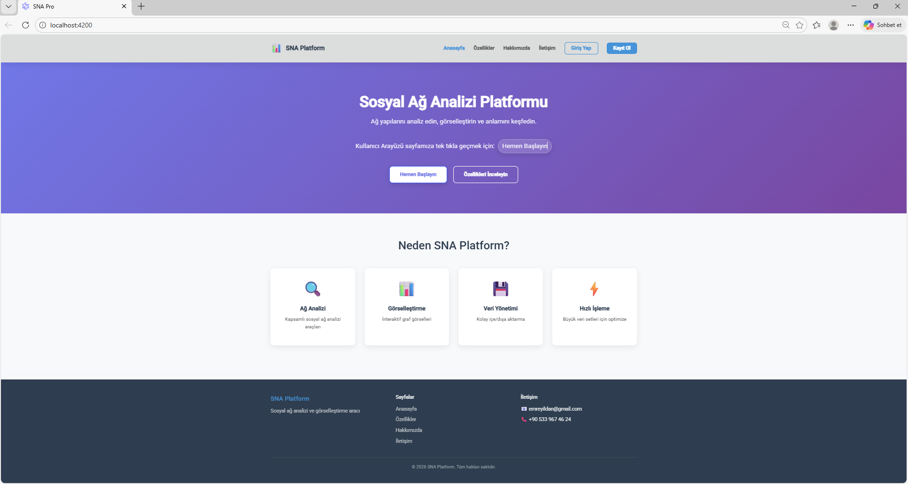

### Hakkımızda

Proje hakkında detaylı bilgiler:

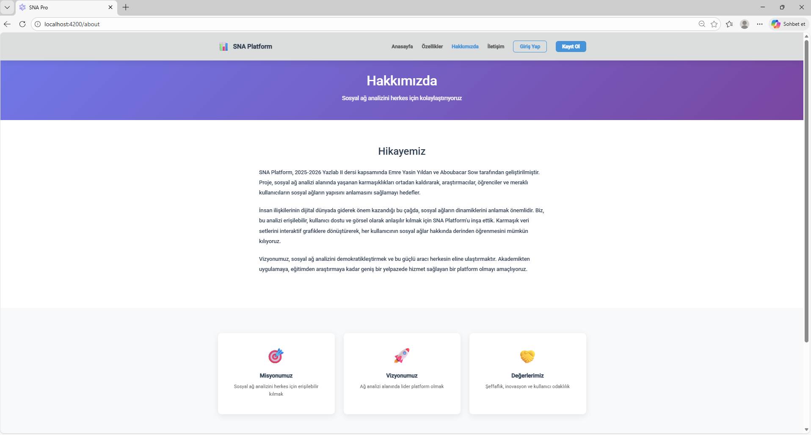

### Özellikler

Uygulamanın sunduğu özellikler:

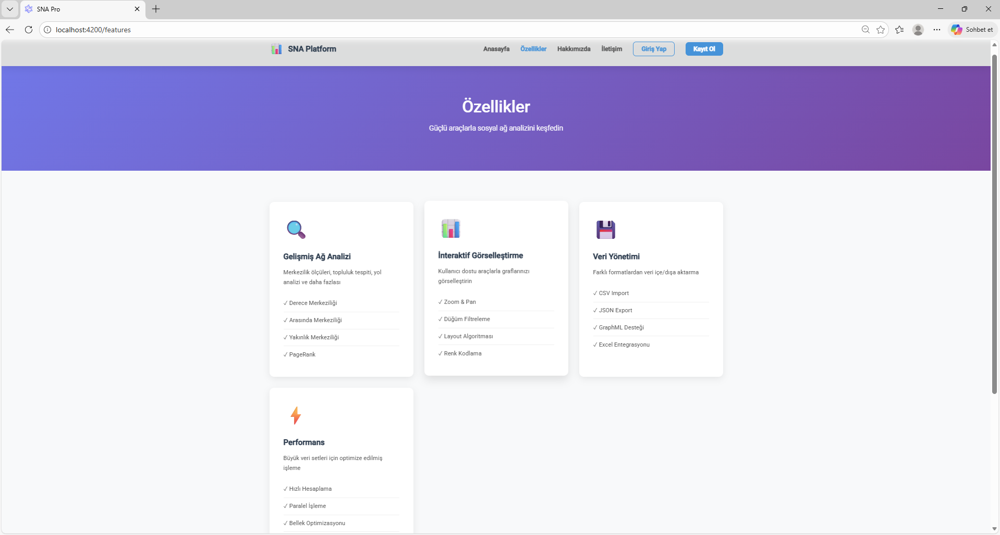

### İletişim

İletişim bilgileri ve form:

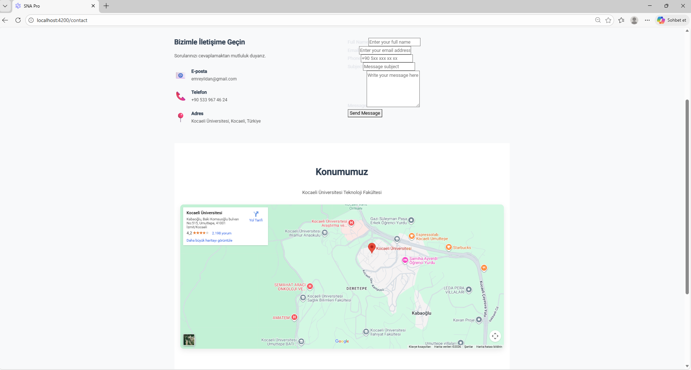

### Kullanıcı İşlemleri

**Giriş Yap:**

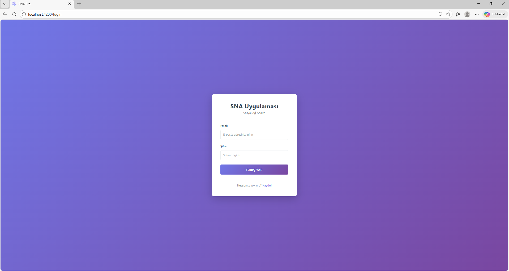

**Kayıt Ol:**

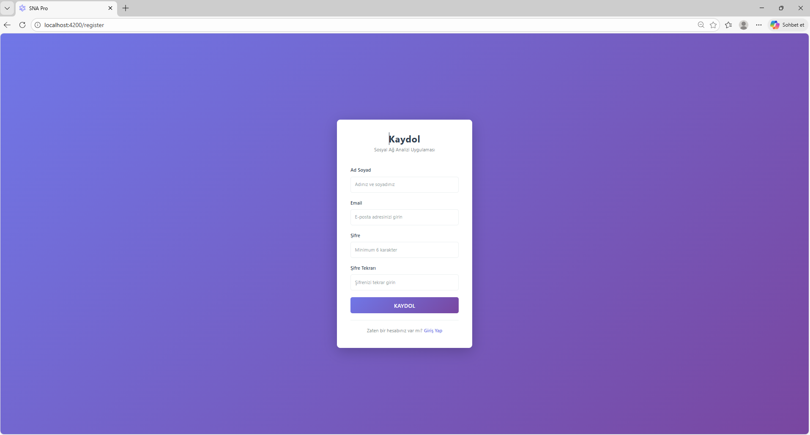

**Graf Oluşturma:**

---

## 💼 Workspace - Genel Görünüm

Uygulamanın ana çalışma alanı:

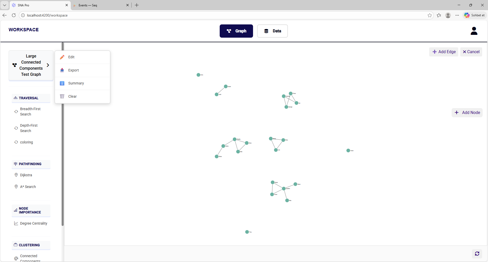

**Workspace Bilgileri:**

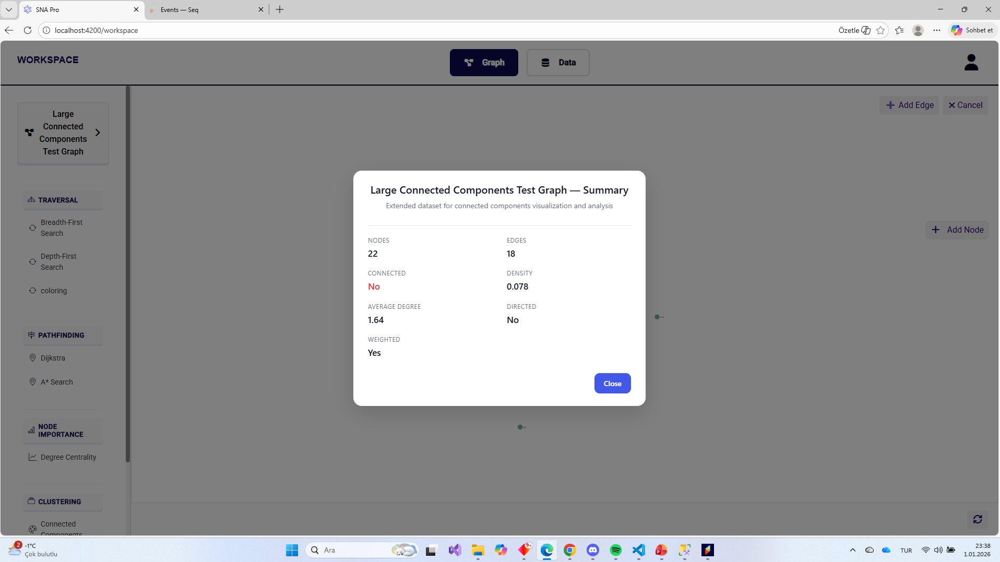

---

## 📊 Graph View - Algoritma Gösterimi

### BFS Algoritması Çalıştırması

Breadth-First Search algoritmasının graf üzerinde çalıştığı görülüyor:

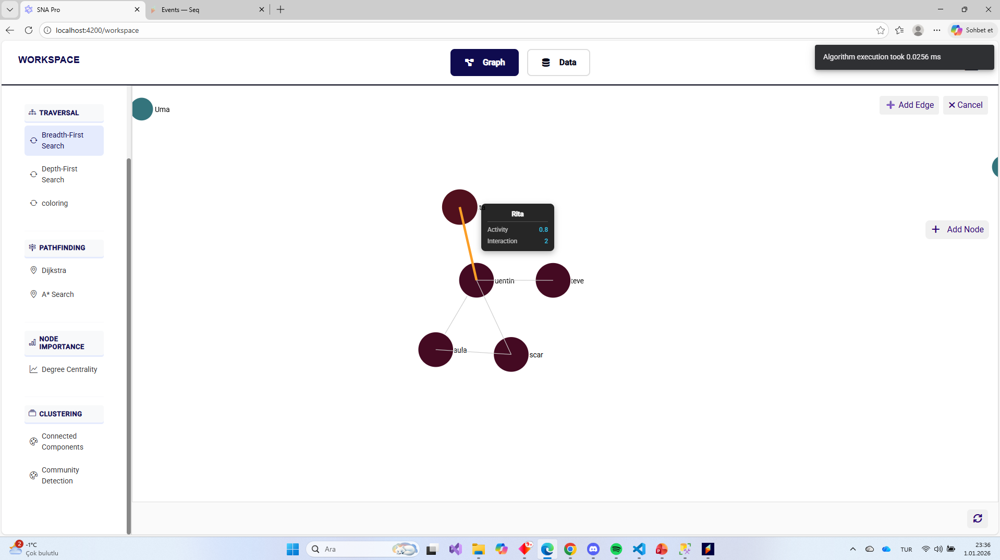

### DFS Algoritması Çalıştırması

Depth First Search algoritmasının graf üzerinde çalıştığı görülüyor:

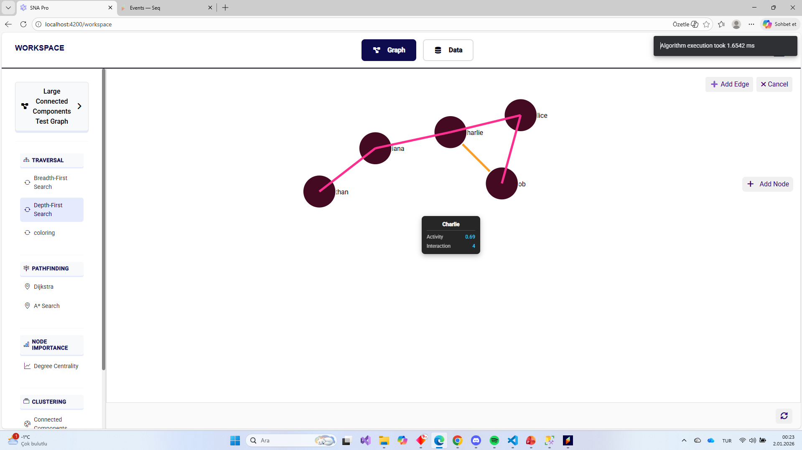

### Welsh-Powell Graf Renklendirme

Komşu düğümlerin farklı renklerle renklendirilen gösterimi:

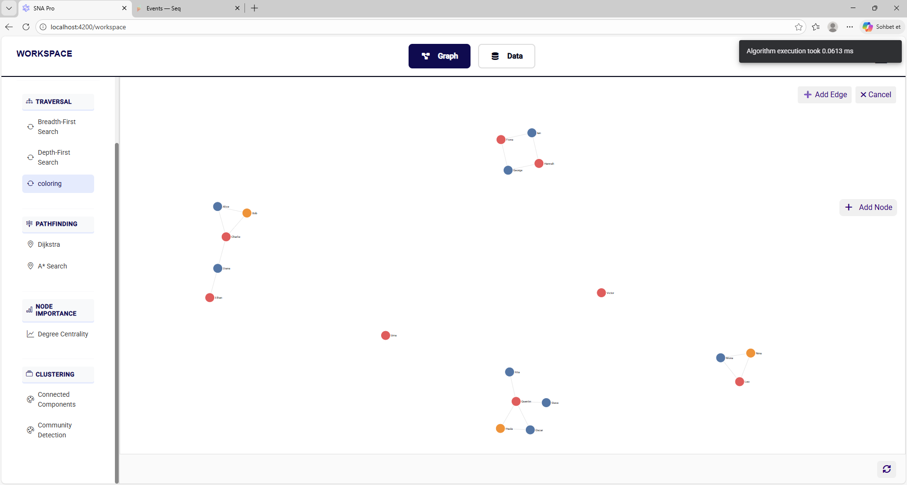

### Algoritma Sonuçlarını Görüntüleme

Tüm Çalıştırılan Algoritmaların Sonuçlarını tek tıkla görüntülemek için

 

---

## 📈 Data View - Veri Yönetimi

### Tablo Görünümü

Düğüm ve kenarların tablo formatında gösterilmesi:

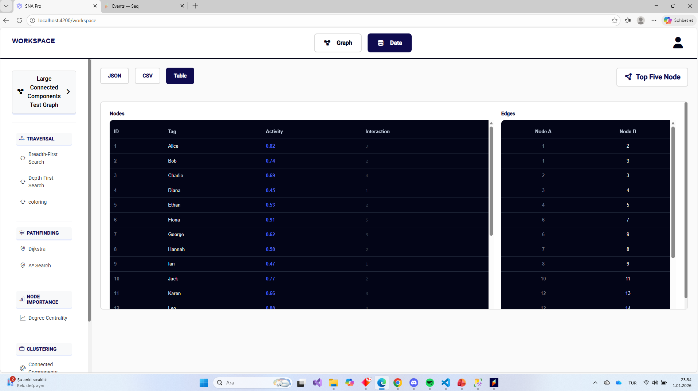

### En Etkili 5 Düğüm

Merkezilik analiziyle bulunan en etkili 5 düğümün gösterimi:

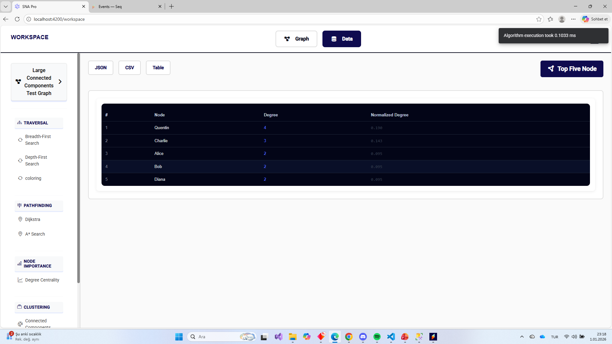

### JSON Format Export

Grafın JSON formatında export edilmiş hali:

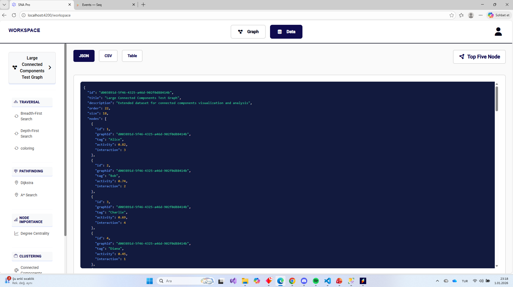

### CSV Format Export

Grafın CSV formatında export edilmiş hali:

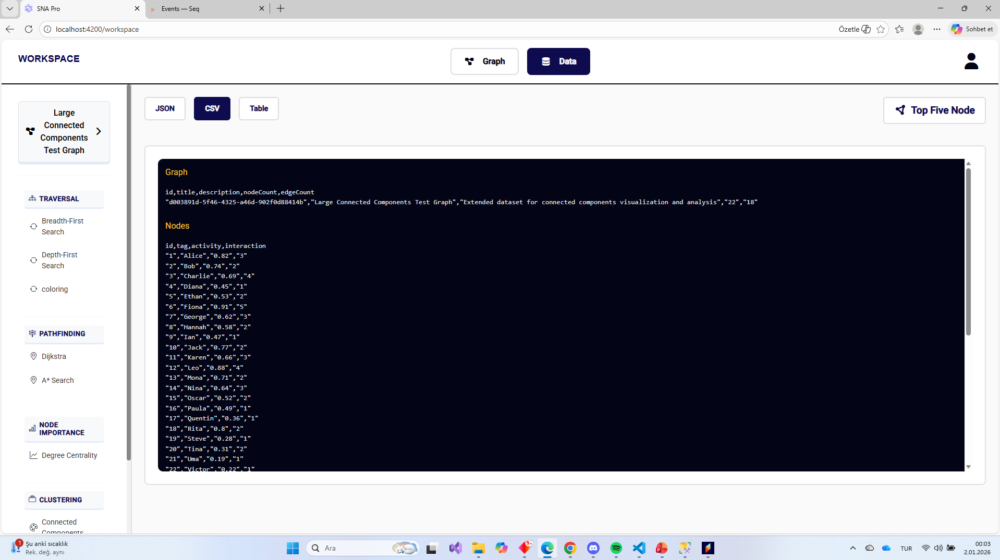

---

## 📝 Özet

| Bölüm | Açıklama | Durumu |
|-------|----------|--------|
| Landing Page | Ana sayfa, hakkımızda, özellikler, iletişim, giriş/kayıt | ✅ 7 resim |
| Workspace | Ana çalışma alanı | ✅ 2 resim |
| Graph View | Algoritma gösterimi | ✅ 3 resim (BFS, DFS, Coloring) |
| Data View | Veri yönetimi | ✅ 4 resim (Tablo, Top5, JSON, CSV) |

**Toplam:** 16 ekran görüntüsü

---

**Tüm bu bileşenler modern ve responsive bir arayüzle sunulmaktadır.**

[← Ana README'ye Dön](../README.md)
